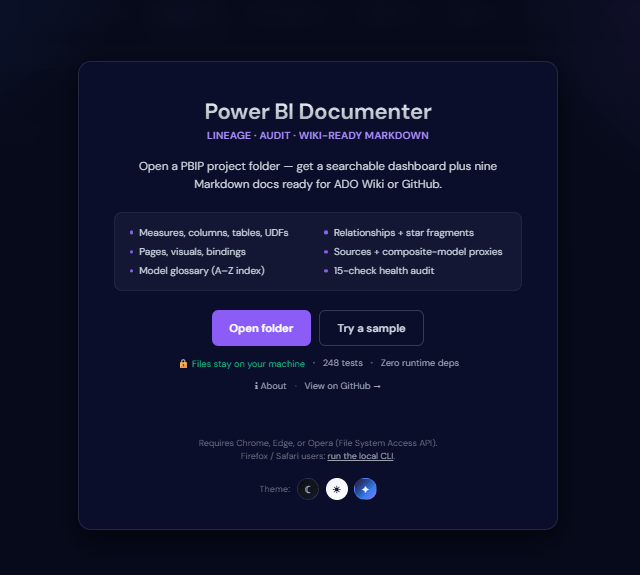
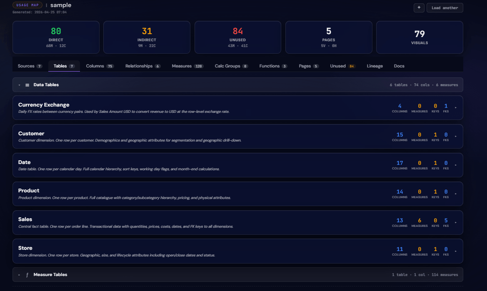

# Power BI Documenter

> **Lineage · Audit · Wiki-ready Markdown**

Open a PBIP project folder — get a searchable dashboard plus nine Markdown docs ready for ADO Wiki or GitHub. Runs **entirely in your browser** (nothing uploads) or as a **local CLI**.

<p align="center">
  <a href="https://jonathan-pap.github.io/PowerBI-Lineage/"></a>
</p>

<p align="center">
  
  
  
</p>

<p align="center">
  
</p>

## What you get

- **Interactive dashboard** — 10 tabs covering measures, columns, tables, relationships, sources, calc groups, UDFs, pages with layout wireframe, unused/orphan analysis, lineage click-through
- **Nine Markdown docs** auto-generated, paste-ready for ADO Wiki or GitHub
- **Improvements audit** — 15 checks across five severity tiers (high / medium / low / info / strengths)
- **Source Map** — flat PBI-column → physical-source lineage with CSV export
- **Page layout wireframe** — SVG thumbnail of each page showing visuals at true canvas positions
- **Privacy by default** — browser-mode files never leave your machine; CLI binds to loopback only

## Tour

### Measures, columns, tables — with lineage

<table>
<tr>
<td width="50%"></td>
<td width="50%"></td>
</tr>
<tr>
<td><b>Measures tab</b> — DAX dependencies, where-used per visual + page, direct/indirect/unused status, descriptions inline.</td>
<td><b>Tables tab</b> — grouped by role (Fact / Dimension / Bridge / Calc group). Per-table stats for columns, measures, keys, FKs.</td>
</tr>
<tr>
<td width="50%"></td>
<td width="50%"></td>
</tr>
<tr>
<td><b>Click-to-trace lineage</b> — upstream DAX dependencies, source tables, functions. Downstream visuals + measures that feed into it.</td>
<td><b>UDF reference</b> — parameters, body, and every measure that calls each function. Here: one UDF powering 53 measures.</td>
</tr>
</table>

### Report layout — audited

<table>
<tr>
<td width="55%"></td>
<td width="45%"></td>
</tr>
<tr>
<td><b>SVG wireframe</b> — each page's visuals at true canvas positions. Charts, cards, slicers, tables, maps, AI visuals — shapes and buttons deliberately filtered.</td>
<td><b>Per-visual bindings</b> — every measure + column each visual consumes, with type chips and chart-level breakdowns. Hover the wireframe for field-well tooltips.</td>
</tr>
</table>

### Wiki-ready Markdown

<p align="center">
  
</p>

Nine Markdown documents — paste-ready for ADO Wiki or GitHub, anchor-stable, Mermaid-native.

| Doc | What's in it |
|---|---|
| **Model** | Technical spec — front matter, schema summary, per-table breakdown, relationships, pages roll-up |
| **Data Dictionary** | Per-table column catalog with PK / FK / CALC / HIDDEN badges + star-schema Mermaid fragments |
| **Sources** | Data-sources catalog, partition modes, field parameters, composite-model proxies |
| **Measures** | A–Z reference with dependencies, bindings, per-measure Mermaid lineage |
| **Functions** | UDF reference — parameters, description, body |
| **Calc Groups** | Calculation-group reference with per-item descriptions |
| **Pages** | Per-page visual catalog — type, title, field bindings for every visual |
| **Improvements** | Prioritised action list — severity-tiered with rationale |
| **Index** | Alphabetical glossary of every named entity across the model |

Plus a **Changelog** tab exposing the project's release history.

## Try it

### Browser (no install)

**[→ Open the browser build](https://jonathan-pap.github.io/PowerBI-Lineage/)** — requires Chrome, Edge, or Opera (File System Access API).

1. Click **Open folder** — pick the PBIP project parent folder (the one that contains both `<Name>.Report` and `<Name>.SemanticModel`). Or click **Try a sample** for a one-click demo.
2. When multiple project pairs exist under one parent, a pair-picker lets you choose which Report + Semantic Model to load. Report-only and Model-only modes are also supported.
3. Dashboard renders in the same page.

Firefox / Safari users: run the CLI ([see below](#running)) — the File System Access API is Chromium-only.

### Running — CLI mode

Requires Node.js 18+ and a `.Report` folder with its `.SemanticModel` sibling.

**Double-click (Windows):**

```
launch.bat
```

First run does `npm install` + `npm run build`, then starts the app and opens your browser.

**From the terminal:**

```sh
npm install
npm run build
node dist/app.js
```

The app listens on `http://127.0.0.1:5679` (loopback only — nothing leaves your machine). Paste the `.Report` path or use the picker. Recent reports are remembered.

## How it works

### Browser mode

The same parser + data-builder that power the CLI run client-side via three small shims:

- `src/browser/fs-shim.ts` — pretends to be `fs` but reads from an in-memory Map
- `src/browser/path-shim.ts` — POSIX-style `path` replacement
- `src/browser/fsa-walk.ts` — walks a `FileSystemDirectoryHandle` into the Map

An import-map in `docs/index.html` redirects bare `import … from "fs"` / `"path"` to the shims. The parser never knows the difference.

### Build + deploy

```sh
npm run build:browser    # → ./docs/
npm run serve:browser    # → 127.0.0.1:5700
```

`.github/workflows/pages.yml` auto-publishes `docs/` to GitHub Pages on every push to `main`.

## Project layout

```
src/
  pbir-reader.ts       Read-only access to PBIR report/page/visual JSON
  model-parser.ts      findSemanticModelPath + TMDL + BIM parsers
  report-scanner.ts    Walks visuals/filters/objects to extract field bindings + positions
  data-builder.ts      Cross-references model + report into FullData
  md-generator.ts      Nine MD docs, ADO Wiki-safe anchors, Mermaid lineage/star blocks
  improvements.ts      15-check audit — severity-tiered recommendations
  html-generator.ts    Dashboard HTML template
  client/              Dashboard runtime (tabs, search, sort, lineage view, wireframe)
  render/              Shared escape helpers
  app.ts               CLI HTTP server + landing page
  browser/             FSA walker + shims + entry shell

scripts/
  build-browser.mjs    Assembles docs/ from dist/ + browser TS output
  bake-sample.mjs      Bakes a sample PBIP into docs/sample-data.json
  serve-browser.mjs    Tiny static server for local testing

changelog/             Per-version release notes (one file per release)
tests/                 node:test suites — 157 tests, zero framework deps
```

## Zero runtime dependencies

Runtime deps: none. Only Node builtins (`fs`, `path`, `http`, `crypto`, `child_process`). Dev-deps are `typescript` + `@types/node` only — needed to build.

## Developing

```sh
npm run typecheck    # tsc --noEmit
npm test             # compile + run Node's built-in test runner
npm run build        # compile CLI to dist/
npm run build:browser  # compile + assemble docs/ + bake sample
```

Tests use the stdlib `node:test` module. `.github/workflows/ci.yml` runs typecheck + tests + build on every push and PR across Node 18 / 20 / 22.

## Publishing to Azure DevOps Wiki

Each of the nine generated MDs starts with an HTML comment suggesting its wiki page name:

```markdown
<!-- Suggested ADO Wiki page name: Health_and_Safety/Measures -->
# Measures Reference
```

**To publish:**

1. Open the dashboard for your report, switch to the **Docs** tab
2. For each doc (Model / Data Dictionary / Sources / Measures / Functions / Calc Groups / Pages / Improvements / Index):
   - Click **⎘ Copy** to copy the markdown
   - In ADO Wiki, create a new page with the name from the `<!-- Suggested ADO Wiki page name: ... -->` hint
   - Paste
3. If you want ADO's auto-TOC instead of the hand-rolled one, type `[[_TOC_]]` at the top of the page

### Compatibility

| Feature | ADO Wiki | GitHub | Dashboard |
|---|---|---|---|
| Anchors (jump-to nav, cross-references) | ✅ via `adoSlug` algorithm | ✅ | ✅ |
| `<details>` / `<summary>` collapsibles | ✅ native | ✅ native | ✅ native |
| Pipe tables | ✅ | ✅ | ✅ |
| Fenced `dax` code blocks | ✅ syntax-highlighted | ✅ | ✅ syntax-highlighted |
| ```` ```mermaid ```` lineage / star fragments | ✅ native | ✅ native | ⚠ code-block fallback (acceptable) |
| Badge `<span>` styling | ⚠ CSS stripped — emoji-prefixed plain text (`🔑 PK`) | ⚠ same fallback | ✅ styled pill |
| Auto-anchor from heading | ✅ | ✅ | ✅ |

Every anchor link is verified by `tests/md-anchors.test.ts` — drift fires CI.

## Changelog

Release notes live under [`changelog/`](changelog/) — one file per release. See [`changelog/README.md`](changelog/README.md) for the full index.

Latest: **[v0.8.0](changelog/0.8.0.md)** — Browser mode, pair picker, Source Map, page-layout wireframe.
